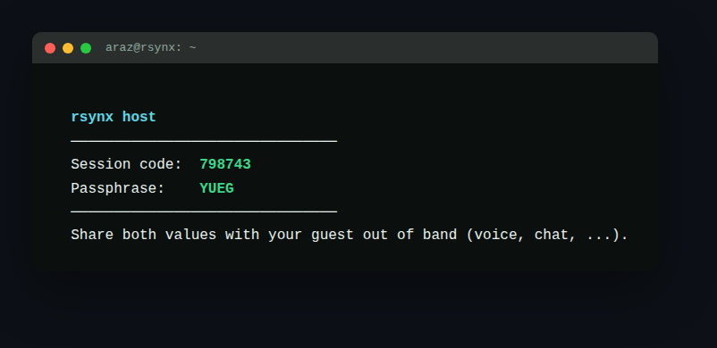

# rsynx

rsynx یک ابزار متن‌باز خط‌فرمان برای اشتراک‌گذاری زندهٔ ترمینال بین دو نفر است — چیزی شبیه
AnyDesk اما برای ترمینال؛ بدون نیاز به SSH، بدون نیاز به IP عمومی، و بدون تنظیم فایروال.



## ویژگی‌ها

- **بدون تنظیمات شبکه**: نه SSH، نه IP عمومی، نه port forwarding — فقط یک کد شش‌رقمی و یک
  رمز عبور چهار کاراکتری.
- **رمزنگاری سرتاسر (end-to-end)**: کلید رمزنگاری فقط در حافظهٔ دو طرف نشست وجود دارد؛ سرور
  relay هرگز به محتوای پیام‌ها یا کلید دسترسی ندارد.
- **تأیید صریح میزبان**: هیچ اتصالی، و هیچ انتقال کنترل تایپی، بدون تأیید مستقیم میزبان در
  همان لحظه انجام نمی‌شود.
- **چت داخل همان صفحه**: بدون نیاز به ابزار جانبی برای هماهنگی حین اشتراک‌گذاری.
- **باینری standalone**: نصب با یک خط دستور، بدون نیاز به Node.js یا وابستگی جداگانه.

## نصب

```bash
curl -fsSL https://rsynx.ir/i | sh
```

## استفاده

میزبان یک نشست جدید می‌سازد:

```bash
rsynx host
```

یک کد شش‌رقمی و یک رمز عبور چهار کاراکتری نمایش داده می‌شود. طرف مقابل با همان کد وصل
می‌شود:

```bash
rsynx join <code>
```

بعد از وارد کردن رمز، میزبان درخواست اتصال را تأیید یا رد می‌کند. پس از تأیید، مهمان
می‌تواند ترمینال میزبان را زنده تماشا کند، در همان صفحه چت کند، و در صورت تأیید مجدد
میزبان، کنترل تایپ ترمینال را موقتاً بگیرد — کنترلی که میزبان هر لحظه می‌تواند پس بگیرد.

## ساختار پوشه‌ها

```
rsynx/
├── apps/
│   ├── cli/       ابزار خط‌فرمان (host/join، رابط TUI)
│   ├── relay/     سرور واسط WebSocket (فقط فوروارد پیام‌های رمزشده)
│   └── web/       سایت فرود و اسکریپت نصب
├── packages/
│   └── protocol/  رمزنگاری، مشتق‌سازی کلید، و تایپ‌های پیام مشترک
├── docs/          مستندات از جمله SPEC.md
└── .github/       CI/CD
```

مستند کامل پروتکل ارتباطی در [`docs/SPEC.md`](docs/SPEC.md) قرار دارد.

## مشارکت

Pull request ها خوش‌آمدند. لطفاً قبل از تغییرات بزرگ یک issue باز کنید تا دربارهٔ رویکرد
هماهنگ شویم.

## لایسنس

MIT — به [`LICENSE`](LICENSE) نگاه کنید.
